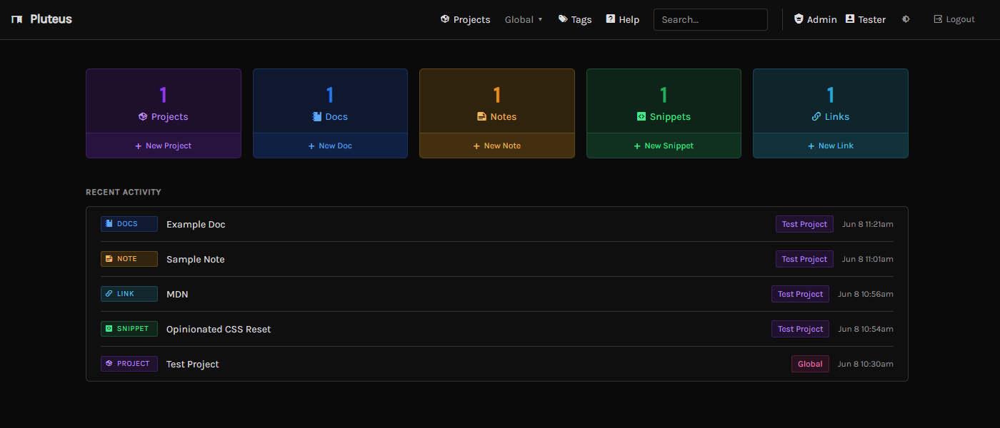
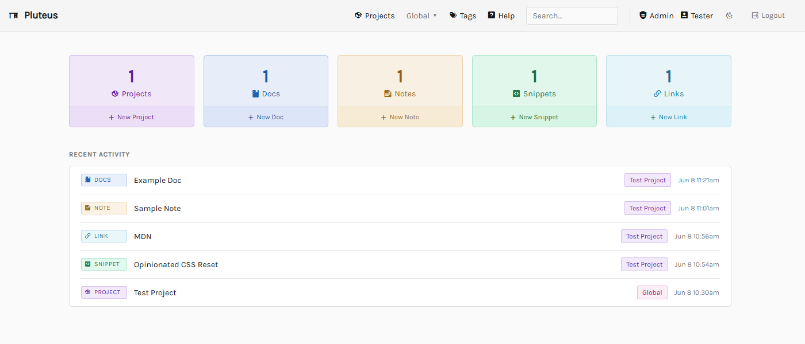
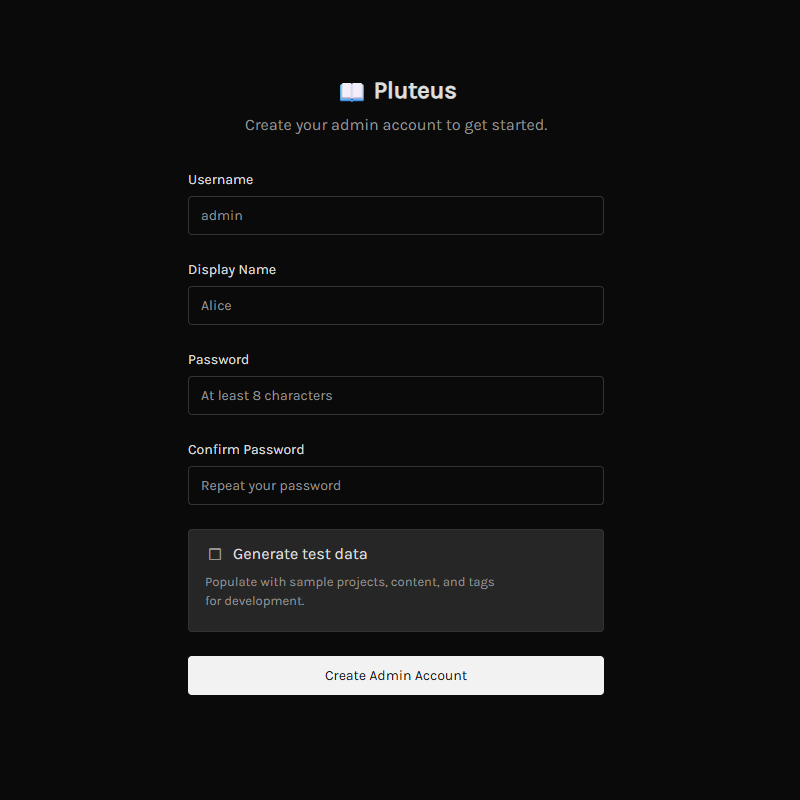
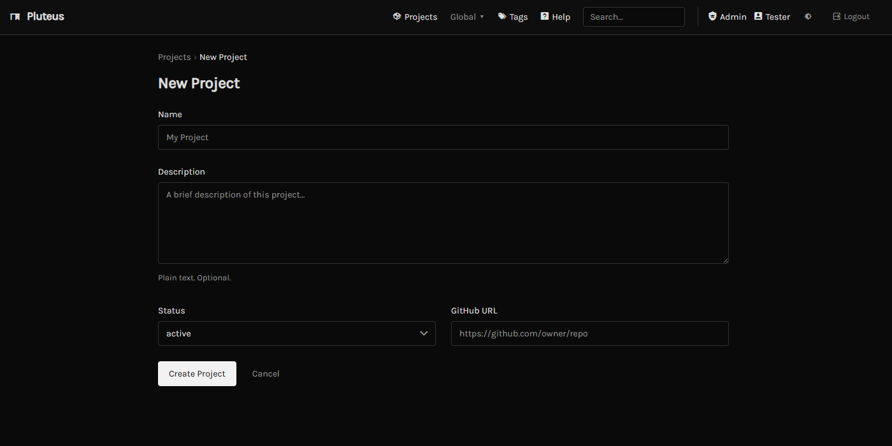
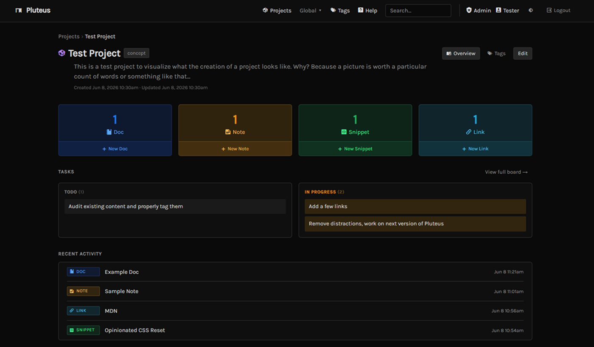
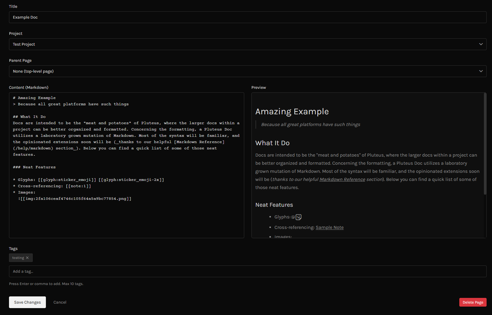
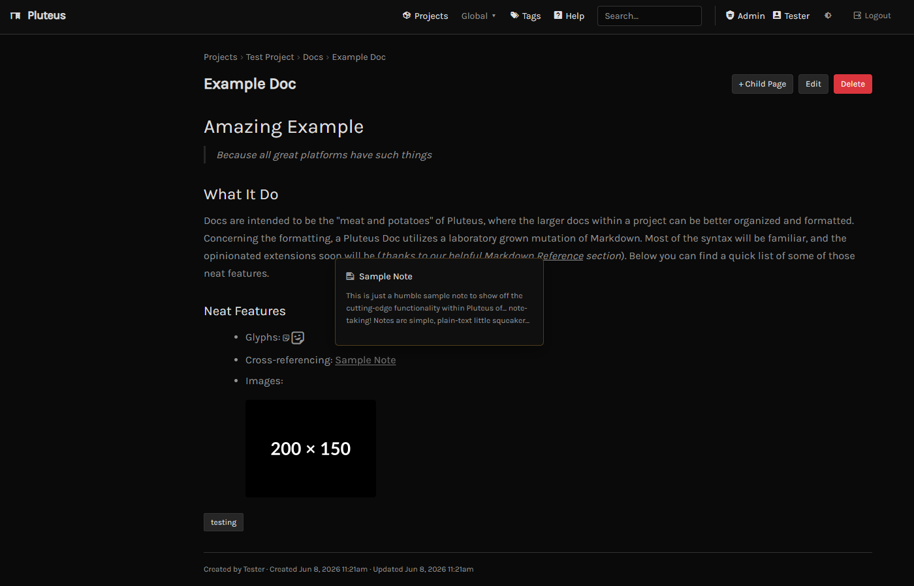
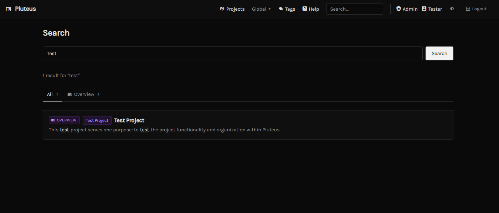
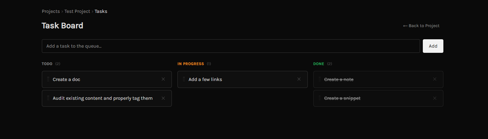

<div align="center">

# Pluteus

**A fast, single-binary knowledge base. Your docs, notes, snippets, and links: organized by project, cross-referenced, tagged, and instantly searchable.**

[](../../releases/latest)
[](LICENSE)




</div>

---

## What is Pluteus

A *pluteus* was the Roman reading desk: a plain, sturdy surface that held your work where you could see it and reach it. Pluteus is that idea in software, a focused, fast knowledge base you run and own.

It ships as a **single binary** with a **single data file**. It starts instantly, has no accounts and no cloud, and stays out of your way. Your knowledge lives in one SQLite file you can copy to back up or move, and nothing leaves your machine unless you decide it should.

Everything you create lives inside a **Project**. Anything that doesn't belong to a specific project lives in **Global**, the project that's always there.

---

## Features

- **Four content types, one home** - Markdown **docs**, plain-text **notes**, language-tagged code **snippets**, and saved **links**, all grouped by project.
- **Cross-references and embeds** - link to or pull in any content from inside a doc with `[[type:id]]` syntax, complete with hover-card previews.
- **Backlinks** - every page shows what references it; the graph builds itself as you write.
- **Full-text search** - SQLite FTS5 across every content type, with ranked, highlighted results.
- **Tags** - one tagging system across all content, with autocomplete and tag browsing.
- **Task boards** - a per-project kanban with drag-and-drop, no page reloads.
- **Images** - upload once, embed anywhere in a doc with a single tag.
- **Dark and light themes** - switch from the nav bar.
- **App-like launch** - opens your browser on start, refuses to run twice, and (on Windows) offers an optional system-tray icon with a windowless mode.
- **Yours to run** - local-first, no telemetry, no subscription. One file is your whole knowledge base.

Prefer a brighter workspace? A light theme ships alongside the dark default, switchable from the nav bar.



---

## Setup

1. Download `pluteus.exe` from the [latest release](../../releases/latest).
2. Put it anywhere and run it:
   ```
   pluteus.exe
   ```
3. Open `http://localhost:8080` in your browser.
4. Create your admin account on the first-run setup screen. Tick **Generate test data** if you just want to explore a populated instance.



A `pluteus.db` and its support files are created next to the executable on first run. That database **is** your knowledge base: copy it to back up or move everything.

By default Pluteus opens your browser on launch and won't start a second instance. On Windows you can run it windowless with an optional system-tray icon (Open / Exit) by setting `tray` in the config below.

---

## Configuration

A `pluteus.json` file sits next to the executable. Defaults are written on first run. Environment variables override the file when set.

```json
{
  "port": "8080",
  "db_path": "./pluteus.db",
  "uploads_path": "./uploads",
  "open_browser": true,
  "tray": false
}
```

| File key | Env override | Default |
|---|---|---|
| `port` | `PLUTEUS_PORT` | `8080` |
| `db_path` | `PLUTEUS_DB_PATH` | `./pluteus.db` |
| `uploads_path` | `PLUTEUS_UPLOADS_PATH` | `./uploads` |
| `open_browser` | `PLUTEUS_OPEN_BROWSER` | `true` |
| `tray` | `PLUTEUS_TRAY` | `false` |

Relative `db_path` / `uploads_path` values resolve against the executable's directory, so a double-clicked binary always keeps its data beside itself.

---

## Using Pluteus

### Start with a project

Projects are the containers that give your content a home. Create one with a name, an optional description, a status, and an optional GitHub URL. Anything you don't file under a project lands in **Global**.



A project page gathers everything: stat cards for each content type, a task-board preview, and a recent-activity feed.



### Write docs

Docs are the backbone. They're Markdown pages organized in a tree with breadcrumb navigation, and they're the connective tissue of Pluteus: docs are the only place cross-references and embeds originate. The editor renders a **live preview** beside your Markdown as you type.



### Link and embed with cross-references

Inside any doc, point at or pull in other content:

| Syntax | Does |
|---|---|
| `[[doc:slug]]` `[[note:id]]` `[[snippet:id]]` `[[link:id]]` `[[project:slug]]` | Inline link with a hover-card preview |
| `![[note:id]]` `![[snippet:id]]` `![[img:filename]]` | Embed the content inline |
| `[[glyph:name]]` | Inline icon. Size it up with `[[glyph:name-2x]]` or `[[glyph:name-4x]]` |

Hover any cross-reference link to preview the target without leaving the page.



### Notes, snippets, and links

- **Notes** are short plain-text captures, quick to write and pinnable.
- **Snippets** are language-tagged code blocks with syntax highlighting and one-click copy.
- **Links** are saved URLs with a title, description, category, and tags.

### Images

Upload an image once, then embed it in any doc with `![[img:filename]]`. Images are supporting media for your docs, managed from the image library.

### Find anything: search and tags

Full-text search covers every content type and highlights matches; filter results by type with the tabs. Tags work across all content, with autocomplete on entry and a browse page to pivot by tag.



### Track work on the task board

Every project has a kanban board with TODO / In Progress / Done columns and drag-and-drop between them. Moves update in place, with no page reload.



### Tips

- **Glyphs** are inline icons via `[[glyph:name]]`. Browse and copy them from the in-app **Help → Glyphs** page.
- **Themes** switch instantly from the nav bar; your choice is remembered.
- **Pin** important notes to float them to the top of the list.
- **Global** is the always-present project for anything that doesn't belong elsewhere; reach it from the top nav.
- The in-app **Help** section has a full Markdown reference and a glyph browser - the authoritative cheat sheet lives there, not in this README.

---

## Roadmap

- Linux and macOS builds

---

## Built with

- [Go](https://go.dev)
- [HTMX](https://htmx.org)
- [SQLite](https://sqlite.org) via [modernc.org/sqlite](https://pkg.go.dev/modernc.org/sqlite) (pure Go, no CGO)
- [Goldmark](https://github.com/yuin/goldmark) for Markdown rendering
- [highlight.js](https://highlightjs.org) for syntax highlighting

---

## License

GNU General Public License v3.0. See [LICENSE](LICENSE).
