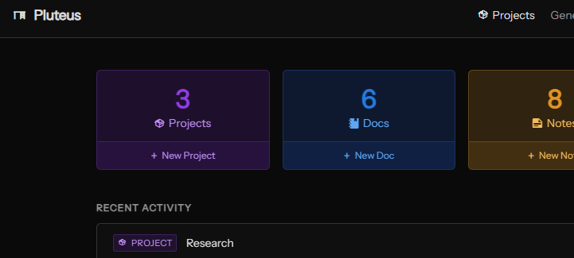

# Pluteus

A self-hosted knowledge base built in Go. Organized by project with Markdown doc pages, plain-text notes, code snippets, and bookmarks: cross-referenced, tagged, and full-text searchable. Single binary, SQLite, no JavaScript framework.

---



## What it is

Pluteus is a private knowledge management tool built for developers. It organizes your work into **projects**, each containing docs, notes, snippets, and bookmarked links. All the content items are cross-referenceable and full-text searchable.

**Content types:**
- **Docs**: Markdown pages with a tree structure, breadcrumb navigation, and cross-references
- **Notes**: Quick plain-text captures, pinnable
- **Snippets**: Syntax-highlighted code blocks with language tagging
- **Links**: External bookmarks with descriptions and tags

**Cross-reference syntax** (inside any doc):
- `[[doc:slug]]` / `[[note:id]]` / `[[snippet:id]]` : inline link with hover preview
- `![[note:id]]` / `![[snippet:id]]` : embed content inline
- Full-text search across all content types

---

## Running Pluteus

1. Download `pluteus.exe` from [Releases](../../releases)
2. Place it anywhere and run it:
   ```
   pluteus.exe
   ```
3. Open `http://localhost:8080` in your browser
4. Complete the first-run setup to create your admin account
5. Optional: if simply testing, you can turn on the test data generation
6. Check the `Help` section to find tips, Mardown syntax cheat sheet, and glyph browser

That's it. A `pluteus.db` and supportive files are created in the same directory on first run.

---

## Configuration

Pluteus is configured via environment variables. No config file needed.

| Variable | Default | Description |
|---|---|---|
| `PLUTEUS_PORT` | `8080` | HTTP server port |
| `PLUTEUS_DB_PATH` | `./pluteus.db` | Path to the SQLite database file |

Example:
```
PLUTEUS_PORT=9000 PLUTEUS_DB_PATH=D:\data\pluteus.db pluteus.exe
```

---

## Requirements

- Windows x64
- A modern browser

No installation, no runtime, no external services.

---

## Planned Features

- Linux/Mac support
- Images!
- Video embedding (_YouTube, Vimeo, etc_)
- 

---

## Built with

- [Go](https://go.dev)
- [HTMX](https://htmx.org)
- [SQLite](https://sqlite.org) via [modernc.org/sqlite](https://pkg.go.dev/modernc.org/sqlite) (pure Go, no CGO)
- [Goldmark](https://github.com/yuin/goldmark) for Markdown rendering
- [highlight.js](https://highlightjs.org) for syntax highlighting

---

## License

GNU General Public License v3.0
